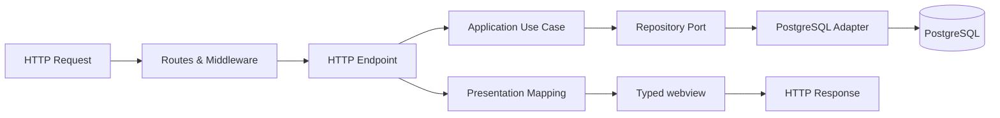

# Architecture

This page is a contributor reference for the Kumbuka server codebase. It is not required for installing or administering Kumbuka.

Kumbuka runs as a modular Go monolith backed by PostgreSQL. A separate `kumbuka-cli` binary provides static-site builds, Git-friendly mirrors, and plugin-project tooling.

A normal server request moves through one HTTP orchestration layer into application use cases and persistence:

## Main packages

- `cmd/kumbuka` starts the server by calling `internal/app.Run`.
- `internal/app` is the process composition root. It contains `run.go`, which constructs dependencies, starts background work, runs the HTTP server, and coordinates shutdown.
- `internal/application` contains application use cases grouped by capability. Page work is split into focused lookup, search, directory, reporting, personal, history, mutation, presence, discussion, review, and bulk capabilities.
- `internal/http/server` owns HTTP adapter construction and route registration.
- `internal/http/endpoint` parses requests, invokes application use cases, maps application results into response models, and selects HTTP responses.
- `internal/http/auth`, `internal/http/routes`, and `internal/http/response` own authentication, middleware/routing policies, and HTTP response mapping.
- `internal/postgres` is the PostgreSQL adapter and owns SQL, migrations, and `pgx`.
- `internal/webview` passively renders typed presentation models. It does not load application data or access persistence.
- `internal/pluginruntime` constructs the Markdown/plugin/WASM runtime.
- `internal/pagecontent` adapts Markdown rendering for persisted page artifacts without coupling application use cases to the concrete renderer.
- other packages under `pkg/` provide reusable runtime and public API types such as Markdown, plugins, revisions, icons, logging, themes, and shared domain models.
- `web` contains the browser assets used by the server.

The standalone CLI reuses public packages from the server repository but has its own command and project-specific code in `github.com/kumbuka-me/cli`.

## Composition and dependency boundaries

`internal/app/run.go` decides which concrete components are connected. Adapter packages own the details of constructing their own concrete components; there is no dependency-injection container, service locator, command bus, query bus, mediator, or generic repository layer.

HTTP owns transport concerns such as routes, parameters, forms, cookies, authentication middleware, coarse role checks, status codes, redirects, and response selection. Resource-specific authorization such as page view/edit permission is enforced by application use cases.

Application packages do not depend on HTTP, HTML templates, web views, PostgreSQL, concrete credential/secret implementations, concrete icon catalogs, or the concrete Markdown renderer. They depend on narrow capabilities and consumer-owned repository interfaces.

`internal/postgres` may implement many of those narrow interfaces with one concrete store, but application code does not depend on `*postgres.Store`. SQL and `pgx` remain inside `internal/postgres`.

`internal/webview` is passive. Endpoints load application data and shared browser context, map it into typed screen models, and then render those models. Webview does not call application services, perform authorization lookups, or access PostgreSQL.

Shared page models and typed application errors remain in `pkg/domain` because public plugin capability APIs expose some of those types. Endpoints translate application/domain errors into HTTP responses.

A failed audit, notification, or webhook delivery after a successful primary mutation is logged without reporting the already-committed mutation itself as failed.

## Page access and collections

Page-specific authorization belongs to the application layer. Collection paths use bulk access checks so navigation, search, reports, and other page collections do not issue one access query per page.

The PostgreSQL adapter implements both single-resource and bulk inherited page-access operations. Application collection use cases consume the bulk operation and filter results before returning them to HTTP or plugins.

## Portable archives

`internal/portable` validates portable archive structure and metadata before restoration begins. The HTTP endpoint coordinates uploaded resources and group mapping, while application page capabilities apply page mutations.

Validation happens before writes, but restoration is not a single transaction across resources, groups, and pages.

## Core and plugins

Core provides pages, persistence, authentication and authorization, revisions, drafts, search, routing, sanitization, plugin lifecycle, and generic extension APIs.

Plugins add optional rendering, editor, administration, and presentation features. Executable plugins access host functionality only through the capabilities declared by their package and allowed by the current runtime context. See [Plugin development](plugins/index.md) for the extension model.

`internal/pluginruntime` owns host-side construction of the Markdown renderer and WASM plugin runtime. Application use cases receive only the narrow capabilities they require rather than depending on that concrete runtime.

The SDK owns the versioned package schema, guest ABI, and typed capability clients. The host owns authorization, execution limits, sanitization, and plugin lifecycle. Provider-specific protocols and rendering syntax stay in plugins: for example, External Files constructs GitHub and GitLab requests while core enforces the generic outbound HTTP policy.

Validated SDK packages are cached by archive digest. Their accessors return independent copies, including nested configuration option lists. Keep that ownership contract when adding fields so callers cannot change another render's cached package.
