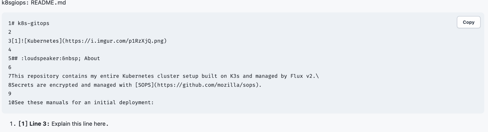
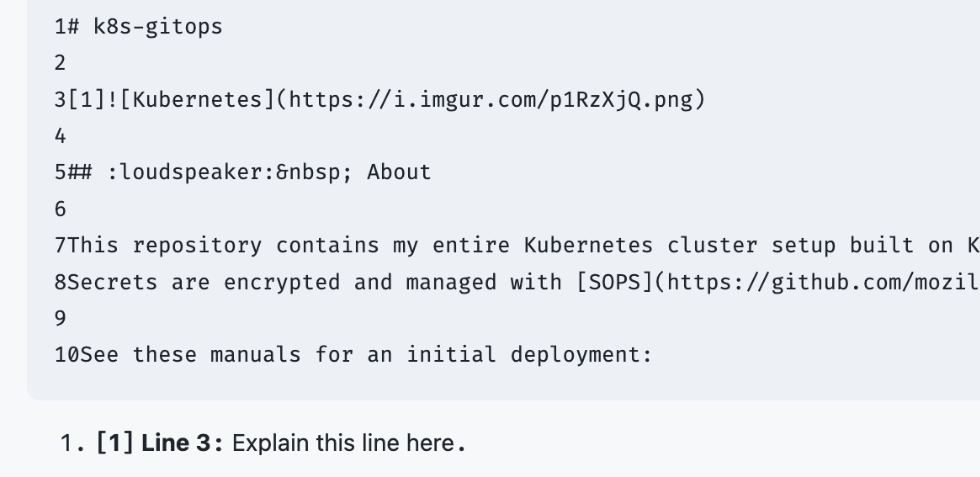

# External Files

The **External Files** plugin embeds whole text files or selected line ranges from configured GitHub and GitLab repositories, including self-hosted instances. Retrieved file content is displayed as text and is never executed or interpreted as Markdown.

The plugin is disabled by default. Its repository connections, presentation defaults, and cache policy are plugin-owned settings under **Administration → Plugin settings → External Files**; Kumbuka core provides only the generic typed-settings, resource, administrator-action, and outbound-HTTP capabilities.

## Configure a source

1. Configure `KUMBUKA__ENCRYPTION_KEY` before storing repository credentials.
2. Install and enable **External Files**.
3. Open **Administration → Plugin settings → External Files**.
4. Under **Sources**, add a unique name, provider, API endpoint, repository, and explicit branch, tag, or commit.
5. Under **Cache**, choose the cache TTL. The default is **1 hour**.
6. For private repositories, add a dedicated read-only access token restricted to that repository.
7. For an internal provider, add the exact RFC1918 or IPv6 ULA addresses the provider hostname is allowed to resolve to.

Common API endpoints are:

- GitHub.com: `https://api.github.com`
- GitHub Enterprise: `https://git.example.com/api/v3`
- GitLab.com: `https://gitlab.com/api/v4`
- self-hosted GitLab: `https://git.example.com/api/v4`

GitHub repositories use `owner/repository`. GitLab repositories may contain nested group paths. Use a commit SHA when annotations must remain stable as the repository changes.

**Skip TLS certificate verification** is off by default. Prefer a trusted CA configured through `SSL_CERT_FILE` or `SSL_CERT_DIR`; use the insecure switch only for a source whose transport you explicitly trust.

## Embed a file

Place each macro on its own line outside a code fence.

Whole file:

```markdown
{{external-file source="engineering" path="src/main.go"}}
```

Single original line:

```markdown
{{external-file source="engineering" path="src/main.go" lines="12"}}
```

Inclusive line range with annotations:

```markdown
{{external-file source="engineering" path="src/main.go" lines="10-25" note="12:Initialize the client." note="19:Handle errors before continuing."}}
```

Repeat `note` to annotate multiple lines or to attach multiple notes to the same line. Annotation line numbers refer to the original file and must fall inside the displayed range. Descriptions are plain text.

Annotations render in a dedicated gutter rather than being inserted into the source text. Line numbers remain separate, so copying the source block does not copy annotation markers.

## Screenshots

Rendered external file with an annotation:



Annotation detail:



## Presentation

The **Appearance** group configures defaults for every External Files embed:

- **Reference position** — `Right` or `Left`; defaults to `Right`.
- **Reference color** — `Accent`, `Blue`, `Green`, `Yellow`, `Orange`, `Red`, `Purple`, or `Gray`; defaults to `Accent`.
- **Highlight referenced lines** — adds a subtle matching highlight to annotated rows.
- **Show line numbers** — displays original file line numbers on the left.
- **Show provider** — displays the GitHub or GitLab provider label in the source header.
- **Show branch, tag, or commit** — displays the configured revision in the source header.

A single embed can override these defaults:

```markdown
{{external-file source="engineering" path="src/main.go" lines="10-25" note="12:Initialize the client." reference-position="left" reference-color="yellow" highlight-references="false" line-numbers="true" show-provider="true" show-branch="false"}}
```

Supported `reference-position` values are `right` and `left`. Supported `reference-color` values are `accent`, `blue`, `green`, `yellow`, `orange`, `red`, `purple`, and `gray`. Boolean overrides accept `true` or `false`.

The rendered source header can show the provider, repository, file path, and configured revision. The annotation gutter can move left or right; source line numbers remain in their conventional left-side gutter.

## Cache behavior

External Files caches each complete validated provider file in a bounded in-memory cache owned by the plugin runtime. The default TTL is **1 hour**. Available values are `5m`, `15m`, `30m`, `1h`, `2h`, `6h`, `12h`, and `24h`. The cache keeps at most 128 complete files and evicts the least recently used entry when full.

The cache refreshes lazily rather than polling repositories in the background. A file inside its TTL is served directly from memory. The first page visit after expiry fetches the file again and replaces the cached value. If that refresh fails, External Files serves the last valid cached copy instead. Files that are never viewed create no refresh traffic.

Use **Refresh cache** under **Administration → Plugin settings → External Files** to mark every cached file stale. The action does not fetch all repositories immediately; each file is fetched again on its next page visit. Editing a source connection also invalidates cached content for that source automatically. The cache is intentionally ephemeral and starts empty after a Kumbuka restart or plugin reload.

## Security and networking

External Files reads its own source settings and constructs the provider request. Kumbuka performs the physical HTTP(S) request through the generic plugin HTTP capability and applies destination validation, request/response limits, timeouts, redirect policy, and TLS policy.

The plugin requests `settings:read` for its configuration, `network:http` for outbound HTTP(S), `network:private` for explicitly configured exact private addresses, and `network:insecure-tls` for the per-source TLS verification override.

Additional safeguards include:

- repository tokens never appear in Markdown, URLs, browser storage, or rendered output;
- public-share rendering cannot fetch external files;
- provider endpoints must use HTTPS;
- private destinations require exact administrator-configured address exceptions; loopback, link-local, metadata, documentation, shared-address, and other special-use destinations remain blocked;
- accepted content is bounded UTF-8 text; binary/control content and Unicode formatting controls are rejected;
- Git LFS objects are not expanded;
- annotations and fetched content are bounded before rendering;
- external content is not persisted in shared rendered-page artifacts or PostgreSQL by the cache; cached files live only in bounded plugin-runtime memory.

An administrator-configured source grants this plugin access to that repository at the selected revision. It is not a per-reader repository ACL. Use a dedicated repository when only a subset of content should be visible through Kumbuka.

## Proxy and CA settings

The host-mediated HTTP client honors the Kumbuka process's conventional networking environment:

- `HTTPS_PROXY` / `https_proxy`
- `HTTP_PROXY` / `http_proxy`
- `NO_PROXY` / `no_proxy`
- `SSL_CERT_FILE`
- `SSL_CERT_DIR`

Proxy configuration belongs to the Kumbuka process rather than the plugin. A source's **Skip TLS certificate verification** setting applies to the origin connection and does not disable proxy TLS verification.
